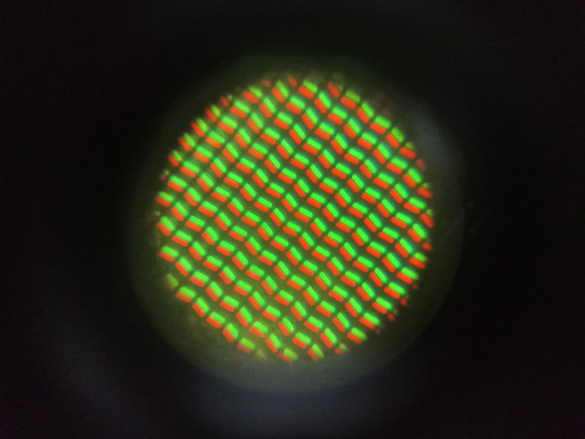
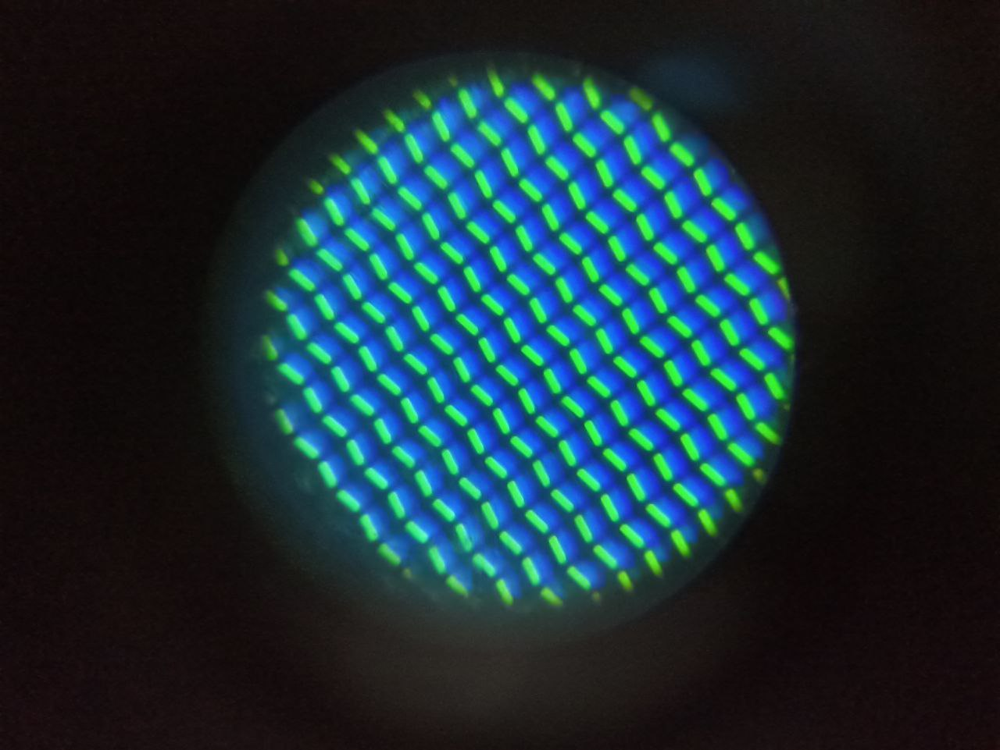
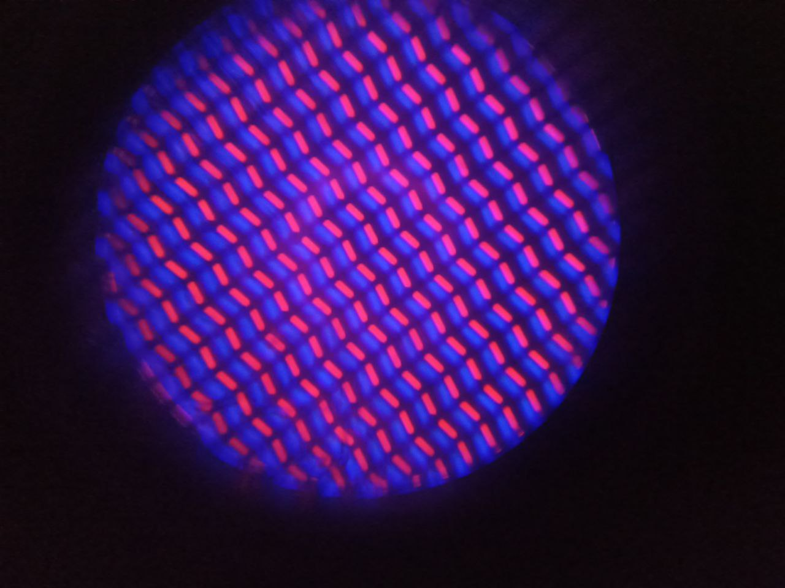

     
    
Color yellow on the IPS LCD Display of the smartphone "Xiaomi Redmi 9". 

     
    
Color light blue on the IPS LCD Display of the smartphone "Xiaomi Redmi 9".

     
    
Color pink on the IPS LCD Display of the smartphone "Xiaomi Redmi 9".

